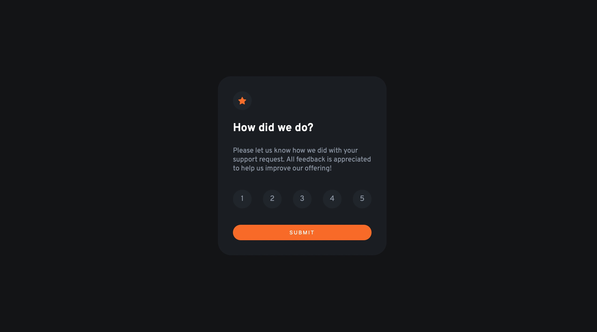

# Frontend Mentor - Interactive rating component solution

This is a solution to the [Interactive rating component challenge on Frontend Mentor](https://www.frontendmentor.io/challenges/interactive-rating-component-koxpeBUmI). Frontend Mentor challenges help you improve your coding skills by building realistic projects. 

## Table of contents

- [Overview](#overview)
  - [The challenge](#the-challenge)
  - [Screenshot](#screenshot)
  - [Links](#links)
- [My process](#my-process)
  - [Built with](#built-with)
  - [What I learned](#what-i-learned)
  - [Continued development](#continued-development)

## Overview

### The challenge

Users should be able to:

- View the optimal layout for the app depending on their device's screen size
- See hover states for all interactive elements on the page
- Select and submit a number rating
- See the "Thank you" card state after submitting a rating

### Screenshot

### Links

- Live Site URL: (https://fe-mentor-interactiverating-component.netlify.app)

## My process

I began by checking the desired design, both desktop and mobile to see how they differed. As they were the same building mobile first wouldn't make much difference here. I then created the html elements before styling with css and making html adjustments. Once that was all working I implemented the Javascript functionality. 

### Built with

- Semantic HTML5 markup
- Flexbox
- CSS Grid
- Javascript

### What I learned
Going back to vanilla html/css/js after using React for a little while made me appreciate some ease of use with React. Specifically adding buttons and creating click events is much more tiresome with vanilla js. 

